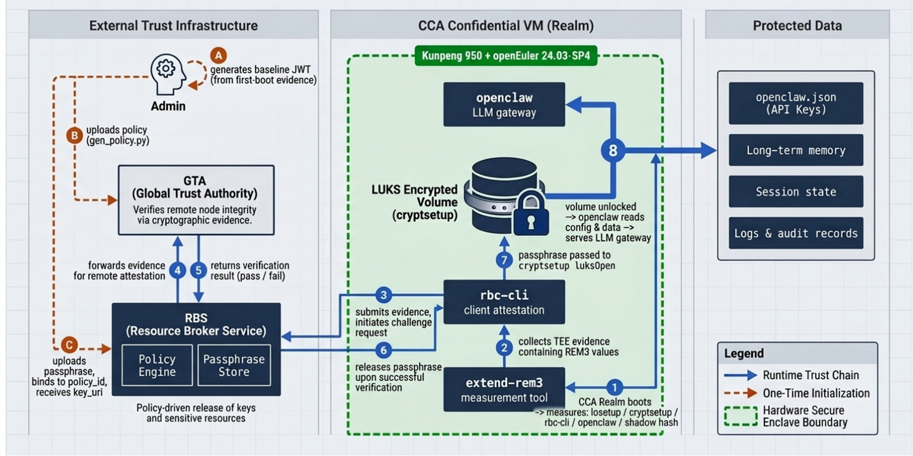

# OpenClaw-CCA 使用手册

## 概述

OpenClaw-CCA 在 ARM CCA 机密虚机（Realm）中运行 OpenClaw LLM 网关，通过 RBC 远程证明将 LUKS 加密卷的解锁密钥与 Realm 度量值绑定，确保只有通过完整性验证的 Realm 实例才能解锁加密卷。加密卷中存放 OpenClaw 的全部静态数据资产，包括：

- **配置数据**（`openclaw.json`）：API Key、LLM 服务端点、工具/技能配置
- **长期记忆**：用户对话历史、用户画像、知识库与向量嵌入
- **会话状态**：持久化会话快照、缓存中间结果
- **运行时元数据**：日志、审计记录、Skill workspace

## 软硬件环境

| 项目 | 说明 |
|------|------|
| 操作系统 | openEuler 24.03-SP4 |
| 硬件平台 | 鲲鹏 950 (Kunpeng 950) |
| 可信执行环境 | ARM CCA (Confidential Compute Architecture) Realm |

鲲鹏 950 处理器支持 ARM CCA 规范，能够创建硬件隔离的机密虚机（Realm），为 OpenClaw-CCA 提供可信执行基础。

---

## 依赖项目简介

本 demo 依赖以下两个 openEuler 开源项目，它们共同构成远程证明与资源分发的信任链路。

### GTA — Global Trust Authority

GTA提供硬件可信验证的远程证明能力，负责验证远程节点（如云实例 / Realm）的完整性，通过密码学证据（TPM、CCA、VirtCCA、Ascend NPU、IMA、DIM 等 Quote）确保其运行在可信状态。

- 代码仓：[https://gitcode.com/openeuler/global-trust-authority](https://gitcode.com/openeuler/global-trust-authority)


### RBS — Resource Broker Service

策略驱动的可信资源分发服务，在客户端通过 GTA 远程证明后，安全地按策略释放密钥、证书等敏感资源给通过验证的负载。

- 代码仓：[https://gitcode.com/openeuler/globaltrustauthority-rbs](https://gitcode.com/openeuler/globaltrustauthority-rbs)

在本 demo 中，Realm 内的 `rbc-cli` 采集含 REM3 的 TEE evidence 提交至 RBS，RBS 验证通过后下发 LUKS passphrase，从而解锁加密卷。

---

## 信任链

```
Realm 启动
  └─ extend-rem3 度量关键组件（losetup / cryptsetup / rbc-cli / openclaw / shadow hash）
       └─ rbc-cli collect-evidence 采集含 REM3 的 TEE evidence
            └─ RBS 验证 evidence 与策略匹配
                 └─ 下发 passphrase → cryptsetup luksOpen → openclaw 启动
```



---

## 前置条件

| 依赖 | 说明 |
|------|------|
| ARM CCA 机密虚机 | 参考：[CCA使用指南](https://docs.openeuler.openatom.cn/zh/docs/25.09/server/security/cca/cca_user_guide.html#cca-使用指南) |
| REM extend tools | 参考：[extend tools]() |
| `rbc-cli` | 已安装于 `/usr/bin/rbc-cli`，参考[globaltrustauthority-rbs](https://gitcode.com/openeuler/globaltrustauthority-rbs) |
| `cryptsetup`,`make`,`gcc`,`openssl`,`jq` | `yum install -y cryptsetup make openssl jq gcc` |
| RBS 服务 | 已部署并可从 Realm 内网络访问 |
| openclaw 二进制 | 用户自行安装，记录安装路径 |

---

## 安装 OpenClaw-CCA 工具

在 Realm 内执行：

```bash
git clone <repo_url>
cd openclaw-cca

# 将 RBS_BASE_URL 替换为实际 RBS 服务地址
sed -i 's|YOUR_RBS_URL_HERE|<your_rbs_url>|' scripts/openclaw-rbc-unlock.sh

make
sudo make install
```

安装后的文件：

```
/usr/local/bin/extend-rem3
/usr/local/sbin/openclaw-rbc-unlock.sh
/usr/local/sbin/openclaw-init.sh
/usr/local/sbin/openclaw-create-volume.sh
/etc/systemd/system/openclaw-luks-unlock.service
```

---

## 首次部署

首次部署需要在**同一登录会话内**连续完成以下所有步骤，中途不能重启虚机。

> **原因**：ARM CCA Realm 重启后 REM[3] 归零。初始化完成的 REM3 度量状态只在当前会话内有效，重启后需重新初始化。

### 步骤一：运行初始化脚本

```bash
sudo openclaw-init.sh
```

脚本自动通过 `which openclaw` 检测路径并打印确认；若未检测到，则提示手动输入：

```
=== OpenClaw-CCA 首次初始化 ===
检测到 openclaw：/opt/nodejs/bin/openclaw
```

或未检测到时：

```
=== OpenClaw-CCA 首次初始化 ===
未检测到 openclaw，请手动输入路径: /usr/local/bin/openclaw
```

脚本自动完成：
1. 将 openclaw 路径写入 `/etc/openclaw-cca/config`
2. 按固定顺序 extend REM3，度量以下组件：
   - `/usr/local/bin/extend-rem3`
   - `/sbin/losetup`
   - `/usr/sbin/cryptsetup`
   - `/usr/bin/rbc-cli`
   - openclaw 二进制
   - 当前用户的 `/etc/shadow` 密码 hash
3. 调用 `rbc-cli` 采集含 REM3 的 TEE evidence
4. 输出基线文件 `/tmp/baseline_jwt.txt`

### 步骤二：生成策略并上传 RBS

在**可信设备**上，使用 `scripts/gen_policy.py` 根据基线文件生成策略，并上传至 GTA 服务端和 RBS（具体操作参考 GTA 及 RBS 文档）：

```bash
python3 scripts/gen_policy.py /tmp/baseline_jwt.txt
```


### 步骤三：生成 passphrase 并上传 RBS

在可信设备生成 passphrase（建议使用强随机值），绑定步骤二生成的policy_id，上传至 RBS，记录返回的 `key_uri`。

```sh
dd if=/dev/urandom bs=32 count=1 2>/dev/null | base64
```

### 步骤四：创建加密卷

**无需准备额外磁盘**。脚本会自动在系统盘上创建一个加密虚拟磁盘文件：

```bash
sudo openclaw-create-volume.sh <key_uri>
```

示例：

```bash
sudo openclaw-create-volume.sh xxxxxxxx-xxxx-xxxx-xxxx-xxxxxxxxxxxx
```

默认创建 1GB 加密存储，挂载于 `/opt/openclaw-data`。如需调整：

```bash
# 自定义大小（20GB）
sudo openclaw-create-volume.sh <key_uri> --size 20

# 自定义挂载路径
sudo openclaw-create-volume.sh <key_uri> --mount /data/openclaw

# 如果系统有空闲块设备（如 /dev/vdb），也可以直接使用：
sudo openclaw-create-volume.sh <key_uri> --device /dev/vdb
```

脚本自动完成：
1. 在 `/root/vfs` 创建虚拟磁盘文件（`--device` 模式下跳过此步）
2. 通过 RBC 远程证明从 RBS 获取 passphrase
3. `cryptsetup luksFormat` 初始化 LUKS2 加密卷
4. `cryptsetup luksOpen` 打开加密卷
5. `mkfs.ext4` 格式化
6. 挂载至指定路径

完成后脚本输出后续操作提示。

> **注意**：`/root/vfs` 是加密存储的数据文件，请勿删除。系统重启后 systemd 会自动重新绑定该文件并解锁加密卷。

### 步骤五：配置 systemd 服务

> **提示**：步骤四完成后，脚本会直接打印出以下所有字段的实际值，照着复制即可。

编辑 unlock 服务：

```bash
sudo systemctl edit --full openclaw-luks-unlock.service
```

将 `REPLACE_ME` 替换为实际值：

```ini
Environment="KEY_URI=xxxxxxxx-xxxx-xxxx-xxxx-xxxxxxxxxxxx"
Environment="DEVICE=/dev/loop7"
Environment="MOUNT_POINT=/opt/openclaw-data"
```

其中：

| 字段 | 默认值（VFS 模式） | 说明 |
|---|---|---|
| `KEY_URI` | 步骤三中 RBS 返回的值 | 不变 |
| `DEVICE` | `/dev/loop7` | 虚拟磁盘绑定的 loop 设备，**不是** `/dev/vdb` |
| `MOUNT_POINT` | `/opt/openclaw-data` | 若步骤四用了 `--mount`，填对应路径 |

> 若步骤四使用了 `--device /dev/vdb`（真实磁盘），则 `DEVICE` 填 `/dev/vdb`，无需 `/dev/loop7`。


### 步骤六：写入 API Key

```bash
sudo nano /opt/openclaw-data/openclaw.json
```

在配置文件中填入 API Key（参考 openclaw 文档中的配置格式）。

### 步骤七：启用服务

```bash
sudo systemctl daemon-reload
sudo systemctl enable openclaw-luks-unlock.service
```

重启虚机验证自动启动是否正常：

```bash
sudo reboot
```

重启后检查服务状态：

```bash
systemctl status openclaw-luks-unlock.service
```

---

## 每次重启的自动流程

虚机重启后，systemd 按以下顺序自动执行：

1. `openclaw-luks-unlock.service` 启动
   - `extend-rem3` 按固定顺序重新度量各组件（REM3 重启后归零）
   - `rbc-cli` 采集 evidence，提交 RBS 验证
   - RBS 验证通过后下发 passphrase
   - `cryptsetup luksOpen` 解锁加密卷并挂载

---

## 更新 openclaw 二进制后的重新初始化

openclaw 二进制在 REM3 度量清单中，更新二进制会导致 REM3 值变化，RBS 策略失效，重启后 unlock 服务将失败。

更新 openclaw 后必须重新走完整初始化流程：

1. 停止服务：`sudo systemctl stop openclaw-luks-unlock.service`
2. 安装新版 openclaw
3. 重新执行步骤一至步骤七（步骤三可复用原 key_id，在 RBS 侧更新策略即可）

---

## 故障排查

### unlock 服务启动失败

```bash
journalctl -u openclaw-luks-unlock.service -n 50
```

常见原因：

| 现象 | 可能原因 | 处理方式 |
|------|---------|---------|
| `extend-rem3` 失败 | `/dev/attest` 不存在或权限不足 | 确认 CCA 驱动已加载 |
| `rbc-cli challenge` 超时 | RBS 不可达 | 等 RBS 就绪后手动重试（见下文） |
| `get-resource` 返回 403 | REM3 与策略不匹配 | 确认是否更新了度量清单中的组件，需重新初始化 |
| `cryptsetup luksOpen` 失败 | passphrase 解密错误 | 检查 RBS 中存储的 passphrase 是否正确 |
| `Device /dev/loop7 does not exist` | loop 设备未绑定（旧版本遗留） | 确认 `/etc/openclaw-cca/config` 中有 `VFS_FILE=` 一行；若无，手动追加：`echo "VFS_FILE=/root/vfs" >> /etc/openclaw-cca/config`，再重启服务 |

### RBS 未就绪导致启动失败：手动重试

若虚机启动时 RBS 服务尚未就绪，`openclaw-luks-unlock.service` 会失败。**等 RBS 可达后，直接重新启动该服务即可**，无需重启虚机：

```bash
# 确认 RBS 已可达
rbc-cli -b "RBS_BASE_URL" challenge -o /dev/null && echo "RBS 正常"

# 重新触发解锁
sudo systemctl start openclaw-luks-unlock.service
```

> **说明**：REM3 是累加寄存器，每次启动只能 extend 一次。脚本会用 `/run/openclaw-rem3-extended` 标记本次启动是否已完成 extend，重试时自动跳过，避免重复 extend 导致 REM3 值与 RBS 策略不符。该标记文件存于 tmpfs，重启后自动消失。

### 手动执行 unlock 流程（调试用）

```bash
sudo /usr/local/sbin/openclaw-rbc-unlock.sh --open <key_uri> <device> <mount_point>
```
