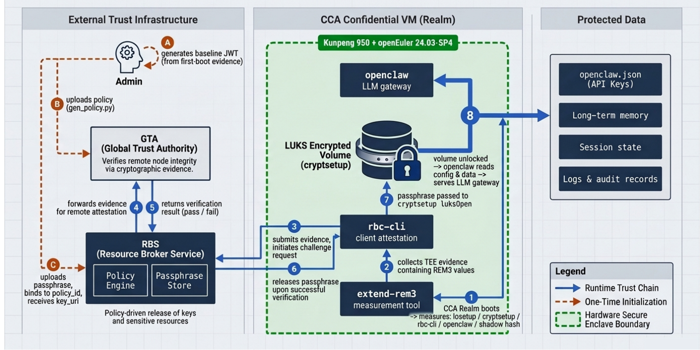

# OpenClaw-CCA 使用手册

## 概述

OpenClaw-CCA 在 ARM CCA 机密虚机（Realm）中运行 OpenClaw LLM 网关，通过 RBC 远程证明将 LUKS 加密卷的解锁密钥与 Realm 度量值绑定，确保只有通过完整性验证的 Realm 实例才能解锁加密卷。加密卷中存放 OpenClaw 的全部静态数据资产，包括：

- **配置数据**（`openclaw.json`）：API Key、LLM 服务端点、工具/技能配置
- **长期记忆**：用户对话历史、用户画像、知识库与向量嵌入
- **会话状态**：持久化会话快照、缓存中间结果
- **运行时元数据**：日志、审计记录、Skill workspace

## 目录

- [软硬件环境](#软硬件环境)
- [依赖项目简介](#依赖项目简介)
- [信任链](#信任链)
- [前置条件](#前置条件)
- [安装 OpenClaw-CCA 工具](#安装-openclaw-cca-工具)
- [首次部署](#首次部署)
  - [步骤一：运行初始化脚本](#步骤一运行初始化脚本)
  - [步骤二：生成策略并上传 RBS](#步骤二生成策略并上传-rbs)
  - [步骤三：生成 passphrase 并上传 RBS](#步骤三生成-passphrase-并上传-rbs)
  - [步骤四：创建加密卷](#步骤四创建加密卷)
  - [步骤五：配置 systemd 服务](#步骤五配置-systemd-服务)
  - [步骤六：写入 API Key](#步骤六写入-api-key)
  - [步骤七：启用服务](#步骤七启用服务)
- [每次重启的自动流程](#每次重启的自动流程)
- [CCA 与 vCCA 配置差异](#cca-与-vcca-配置差异)
- [更新 openclaw 二进制后的重新初始化](#更新-openclaw-二进制后的重新初始化)
- [故障排查](#故障排查)

---

## 软硬件环境

| 项目 | 说明 |
|------|------|
| 操作系统 | openEuler 24.03-SP4 |
| 硬件平台 | 鲲鹏 950 (Kunpeng 950) |
| 可信执行环境 | ARM CCA (Confidential Compute Architecture) Realm，同时支持 vCCA（虚拟 CCA） |

鲲鹏 950 处理器支持 ARM CCA 规范，能够创建硬件隔离的机密虚机（Realm），为 OpenClaw-CCA 提供可信执行基础。vCCA 是 CCA 的虚拟化版本，无需硬件 CCA 支持即可运行。

---

## 依赖项目简介

本 demo 依赖以下两个 openEuler 开源项目，它们共同构成远程证明与资源分发的信任链路。

### GTA - Global Trust Authority

GTA 提供硬件可信验证的远程证明能力，负责验证远程节点（如云实例 / Realm）的完整性，通过密码学证据（TPM、CCA、VirtCCA、Ascend NPU、IMA、DIM 等 Quote）确保其运行在可信状态。

- 代码仓：[https://gitcode.com/openeuler/global-trust-authority](https://gitcode.com/openeuler/global-trust-authority)

### RBS - Resource Broker Service

策略驱动的可信资源分发服务，在客户端通过 GTA 远程证明后，安全地按策略释放密钥、证书等敏感资源给通过验证的负载。

- 代码仓：[https://gitcode.com/openeuler/globaltrustauthority-rbs](https://gitcode.com/openeuler/globaltrustauthority-rbs)

在本 demo 中，Realm 内的 `rbc-cli` 采集含 REM3 的 TEE evidence 提交至 RBS，RBS 验证通过后下发 LUKS passphrase，从而解锁加密卷。

---

## 信任链

```
Realm 启动
  └─ extend-rem3 度量关键组件（losetup / cryptsetup / rbc-cli / openclaw / shadow hash）
       └─ rbc-cli collect-evidence 采集含 REM3 的 TEE evidence
            └─ RBS 验证 evidence 与策略匹配
                 └─ 下发 passphrase -> cryptsetup luksOpen -> openclaw 启动
```


---

## 前置条件

| 依赖 | 说明 |
|------|------|
| ARM CCA 机密虚机 | 参考：[CCA使用指南](https://docs.openeuler.openatom.cn/zh/docs/25.09/server/security/cca/cca_user_guide.html#cca-使用指南) |
| REM extend tools | 参考 [环境搭建指南](setup.md) 中的内核模块安装说明 |
| `rbc-cli` | 已安装于 `/usr/bin/rbc-cli`，参考[globaltrustauthority-rbs](https://gitcode.com/openeuler/globaltrustauthority-rbs) |
| `cryptsetup`,`make`,`gcc`,`openssl`,`jq` | `yum install -y cryptsetup make openssl jq gcc` |
| RBS 服务 | 已部署并可从 Realm 内网络访问（参考 [环境搭建指南](setup.md)） |
| openclaw 二进制 | 用户自行安装，记录安装路径 |
| `/dev/attest` 设备 | 内核 attest 模块已加载，提供 REM3 extend 接口 |

> **RBS 地址**：部署前请确认 RBS 服务的访问地址（如 `http://192.168.1.1:6666`），后续步骤中需要填入。

---

## 安装 OpenClaw-CCA 工具

在 Realm 内执行：

```bash
git clone https://gitcode.com/openeuler/sec-select.git
cd sec-select/solutions/openclaw-cca

# 将 RBS_BASE_URL 替换为实际 RBS 服务地址
sed -i 's|YOUR_RBS_URL_HERE|http://192.168.1.1:6666|' scripts/openclaw-rbc-unlock.sh

make
sudo make install
```

### RBS_BASE_URL 配置说明

`scripts/openclaw-rbc-unlock.sh` 中的 `RBS_BASE_URL` 变量是核心配置项，指定了 RBS 服务的访问地址。所有 rbc-cli 命令（`challenge`、`collect-evidence`、`get-resource`、`get-token`）都会使用该地址。

| 配置项 | 位置 | 说明 |
|--------|------|------|
| `RBS_BASE_URL` | `scripts/openclaw-rbc-unlock.sh` 第 8 行 | RBS REST API 地址，格式为 `http(s)://<host>:<port>` |

> **适配要点**：
> - 如果 RBS 监听在 `0.0.0.0:6666`，使用 RBS 服务器的实际 IP（如 `http://192.168.1.1:6666`）。
> - 如果 RBS 启用了 HTTPS，使用 `https://` 前缀，并确保 Realm 内信任 RBS 的 CA 证书。
> - 此地址必须在 `make install` 之前替换，因为安装时会将脚本拷贝到 `/usr/local/sbin/`。

安装后的文件：

```
/usr/local/bin/extend-rem3                   # REM3 扩展工具
/usr/local/sbin/openclaw-rbc-unlock.sh       # RBC 证明与解锁脚本
/usr/local/sbin/openclaw-init.sh             # 首次初始化脚本
/usr/local/sbin/openclaw-create-volume.sh    # 加密卷创建脚本
/etc/systemd/system/openclaw-luks-unlock.service  # 开机解锁服务
```

---

## 首次部署

首次部署需要在**同一登录会话内**连续完成以下所有步骤，中途不能重启虚机。

> **原因**：ARM CCA Realm 重启后 REM[3] 归零。初始化完成的 REM3 度量状态只在当前会话内有效，重启后需重新初始化。

### 步骤一：运行初始化脚本

```bash
sudo openclaw-init.sh
```

脚本自动通过 `which openclaw` 检测路径并打印确认；若未检测到，则提示手动输入：

```
=== OpenClaw-CCA 首次初始化 ===
检测到 openclaw：/opt/nodejs/bin/openclaw
```

或未检测到时：

```
=== OpenClaw-CCA 首次初始化 ===
未检测到 openclaw，请手动输入路径: /usr/local/bin/openclaw
```

脚本自动完成：

1. 将 openclaw 路径写入 `/etc/openclaw-cca/config`（配置文件格式见下表）
2. 按固定顺序 extend REM3，度量以下组件：
   - `/usr/local/bin/extend-rem3`
   - `/sbin/losetup`
   - `/usr/sbin/cryptsetup`
   - `/usr/bin/rbc-cli`
   - openclaw 二进制
   - 当前用户的 `/etc/shadow` 密码 hash
3. 调用 `rbc-cli` 采集含 REM3 的 TEE evidence
4. 输出基线文件 `/tmp/baseline_jwt.txt`

#### `/etc/openclaw-cca/config` 配置说明

初始化脚本会生成此文件，后续脚本（`openclaw-create-volume.sh`、`openclaw-rbc-unlock.sh`）通过 `source` 命令读取它。

| 字段 | 说明 | 示例值 |
|------|------|--------|
| `OPENCLAW_BIN` | openclaw 二进制路径 | `/opt/nodejs/bin/openclaw` |
| `VFS_FILE` | 虚拟磁盘文件路径（由 `openclaw-create-volume.sh` 自动追加） | `/root/vfs` |

> 该文件权限为 `600`（仅 root 可读写），目录 `/etc/openclaw-cca/` 权限为 `700`。

### 步骤二：生成策略并上传 RBS

在**可信设备**上，使用 `scripts/gen_policy.py` 根据基线文件生成策略，使用 base64 解码并上传至 GTA 服务端和 RBS。

#### 2.1 生成策略

```bash
# CCA 模式（默认）
python3 scripts/gen_policy.py /tmp/baseline_jwt.txt

# vCCA 模式
python3 scripts/gen_policy.py --type vcca /tmp/baseline_jwt.txt
```

`gen_policy.py` 从 JWT 中提取 Realm 度量值并填充 Rego 模板：

| 参数 | 说明 |
|------|------|
| `--type cca` | 使用 CCA 模板（默认），JWT 字段路径为 `cca.realm_token` |
| `--type vcca` | 使用 vCCA 模板，JWT 字段路径为 `virt_cca.realm_token` |
| `<jwt 或文件路径>` | 基线 JWT 字符串或包含 JWT 的文件路径 |

输出为 base64 编码的 Rego 策略，包含以下预填值的度量字段：

| CCA 模式 | vCCA 模式 | 说明 |
|----------|-----------|------|
| `cca_rpv` | `vcca_rpv` | Realm Personalization Value |
| `cca_rim` | `vcca_rim` | Realm Initial Measurement |
| `cca_rem0` | `vcca_rem0` | REM[0] |
| `cca_rem1` | `vcca_rem1` | REM[1] |
| `cca_rem2` | `vcca_rem2` | REM[2] |
| `cca_rem3` | `vcca_rem3` | REM[3]（包含 OpenClaw 组件度量） |

#### 2.2 解码并上传策略至 RBS

```bash
# 解码 resource policy
base64 -d << EOF > ./rego
<上一步输出的 base64 字符串>
EOF

export RBS_SERVER=http://192.168.1.1:6666
export ACCESS_KEY=$(rbs-cli token gen --private-key-file /etc/rbs/admin.pem)
rbs-cli -b ${RBS_SERVER} -t ${ACCESS_KEY} res-policy create \
    --name policy-01 \
    --content @./rego

# 保存上一步生成的 policy-id，如 c28a6e63-b0b2-4fdd-9832-4d297f28e31e
```

> **适配要点**：
> - `--private-key-file` 指向 RBS 管理员私钥（`/etc/rbs/admin.pem`），该文件在 [环境搭建指南](setup.md) 的 [2.8](setup.md#28-生成-rbs-相关密钥) 中生成。
> - `--name` 可自定义，但需记住以便后续引用。
> - **必须保存返回的 `policy-id`**，后续注册资源时需要绑定。

### 步骤三：生成 passphrase 并上传 RBS

在可信设备生成 passphrase（建议使用强随机值），绑定步骤二生成的 policy_id，上传至 RBS。

#### 3.1 生成随机 passphrase

```bash
dd if=/dev/urandom bs=32 count=1 2>/dev/null | base64
# 记录输出值，如：dGhpcyBpcyBhIHNlY3JldCBwYXNzcGhyYXNl
```

#### 3.2 写入 openBao

```bash
export BAO_ADDR=http://127.0.0.1:8200
bao kv put secret/default/secret/openclaw content=${PASSPHRASE}
```

> **路径说明**：`secret/default/secret/openclaw` 对应资源 URI `vault/default/secret/openclaw`。
> - key 名必须为 `content`（`openclaw-rbc-unlock.sh` 通过 `jq -r '.content'` 提取该字段）。

#### 3.3 在 RBS 中注册资源

```bash
export RBS_SERVER=http://127.0.0.1:6666
export ACCESS_KEY=$(rbs-cli token gen --private-key-file /etc/rbs/admin.pem --role Administrator)

rbs-cli -b ${RBS_SERVER} -t ${ACCESS_KEY} res create \
    --provider-name vault \
    --repository-name default \
    --resource-type secret \
    --resource-name openclaw \
    --policy-id c28a6e63-b0b2-4fdd-9832-4d297f28e31e
```

> **记录返回的 `key_uri`**（格式如 `vault/default/secret/openclaw`），后续创建加密卷时需要使用。

### 步骤四：创建加密卷

**无需准备额外磁盘**。脚本会自动在系统盘上创建一个加密虚拟磁盘文件：

```bash
sudo openclaw-create-volume.sh <key_uri>
```

示例：

```bash
sudo openclaw-create-volume.sh vault/default/secret/openclaw
```

#### 参数说明

| 参数 | 说明 | 默认值 |
|------|------|--------|
| `<key_uri>` | 步骤三中 RBS 返回的资源 URI | 必填 |
| `--size <GB>` | 虚拟磁盘大小（GB） | `1` |
| `--mount <路径>` | 挂载路径 | `/opt/openclaw-data` |
| `--device <设备路径>` | 使用已有块设备（如 `/dev/vdb`），跳过虚拟磁盘创建 | 无（默认使用虚拟磁盘） |

```bash
# 自定义大小（20GB）
sudo openclaw-create-volume.sh <key_uri> --size 20

# 自定义挂载路径
sudo openclaw-create-volume.sh <key_uri> --mount /data/openclaw

# 如果系统有空闲块设备（如 /dev/vdb），也可以直接使用：
sudo openclaw-create-volume.sh <key_uri> --device /dev/vdb
```

脚本自动完成：

1. 在 `/root/vfs` 创建虚拟磁盘文件（`--device` 模式下跳过此步）
2. 绑定 loop 设备（`--device` 模式下使用指定块设备）
3. 通过 RBC 远程证明从 RBS 获取 passphrase
4. `cryptsetup luksFormat` 初始化 LUKS2 加密卷
5. `cryptsetup luksOpen` 打开加密卷
6. `mkfs.ext4` 格式化
7. 挂载至指定路径
8. 将 `VFS_FILE` 路径写入 `/etc/openclaw-cca/config`（仅虚拟磁盘模式）

完成后脚本输出后续操作提示。

> **注意**：`/root/vfs` 是加密存储的数据文件，请勿删除。系统重启后 systemd 会自动重新绑定该文件并解锁加密卷。

### 步骤五：配置 systemd 服务

> **提示**：步骤四完成后，脚本会直接打印出以下所有字段的实际值，照着复制即可。

#### 5.1 配置 unlock 服务

编辑 unlock 服务：

```bash
sudo systemctl edit --full openclaw-luks-unlock.service
```

将 `REPLACE_ME` 替换为实际值：

```ini
[Unit]
Description=OpenClaw LUKS Unlock via RBC Attestation
DefaultDependencies=no
After=local-fs.target network-online.target
Wants=network-online.target

[Service]
Type=oneshot
RemainAfterExit=yes

# 部署时填写
Environment="KEY_URI=vault/default/secret/openclaw"
Environment="DEVICE=/dev/loop7"
Environment="MOUNT_POINT=/opt/openclaw-data"

ExecStart=/usr/local/sbin/openclaw-rbc-unlock.sh --open ${KEY_URI} ${DEVICE} ${MOUNT_POINT}

[Install]
WantedBy=multi-user.target
```

| 字段 | 默认值（VFS 模式） | 说明 |
|---|---|---|
| `KEY_URI` | 步骤三中 RBS 返回的值 | 资源 URI，如 `vault/default/secret/openclaw` |
| `DEVICE` | `/dev/loop7` | 虚拟磁盘绑定的 loop 设备，**不是** `/dev/vdb` |
| `MOUNT_POINT` | `/opt/openclaw-data` | 若步骤四用了 `--mount`，填对应路径 |

> 若步骤四使用了 `--device /dev/vdb`（真实磁盘），则 `DEVICE` 填 `/dev/vdb`，无需 `/dev/loop7`。

### 步骤六：写入 API Key

```bash
sudo nano /opt/openclaw-data/openclaw.json
```

在配置文件中填入 API Key（参考 openclaw 文档中的配置格式）。

### 步骤七：启用服务

```bash
sudo systemctl daemon-reload
sudo systemctl enable openclaw-luks-unlock.service
```

重启虚机验证自动启动是否正常：

```bash
sudo reboot
```

重启后检查服务状态：

```bash
systemctl status openclaw-luks-unlock.service
# 如果启用了 openclaw.service
# systemctl status openclaw.service
```

---

## 每次重启的自动流程

虚机重启后，systemd 按以下顺序自动执行：

1. `openclaw-luks-unlock.service` 启动
   - `extend-rem3` 按固定顺序重新度量各组件（REM3 重启后归零）
   - `rbc-cli` 采集 evidence，提交 RBS 验证
   - RBS 验证通过后下发 passphrase
   - `cryptsetup luksOpen` 解锁加密卷并挂载

---

## CCA 与 vCCA 配置差异

OpenClaw-CCA 同时支持硬件 CCA 和虚拟 CCA（vCCA），两者的主要配置差异如下：

### 总体对比

| 方面 | CCA | vCCA |
|------|-----|------|
| 策略模板 | `scripts/policy_template/cca.rego` | `scripts/policy_template/vcca.rego` |
| JWT 字段路径 | `cca.realm_token` | `virt_cca.realm_token` |
| 度量键名 | `cca_rpv`、`cca_rim`、`cca_rem[0-3]` | `vcca_rpv`、`vcca_rim`、`vcca_rem[0-3]` |
| 内核模块 | 需加载 `arm_cca_guest` + `tsm` | 不需要 |
| Attestation Agent 插件 | `cca` 插件 | `virt_cca` 插件 |
| 策略生成 | `gen_policy.py`（默认 CCA） | `gen_policy.py --type vcca` |
| attest skill | `openclaw-cca-attest` | `openclaw-vcca-attest` |

### 各步骤的具体差异

#### 1. Attestation Agent 配置 (`/etc/attestation_agent/agent_config.yaml`)

```yaml
# CCA 模式
plugins:
  enabled:
    cca: true
    virt_cca: false
    # 其他插件保持 false

# vCCA 模式
plugins:
  enabled:
    cca: false
    virt_cca: true
    # 其他插件保持 false
```

#### 2. 内核模块加载

```bash
# CCA 模式：需要加载内核模块
modprobe tsm
modprobe arm_cca_guest
mount -t configfs none /sys/kernel/config

# vCCA 模式：无需加载内核模块（跳过此步骤）
```

#### 3. 策略生成

```bash
# CCA 模式
python3 scripts/gen_policy.py /tmp/baseline_jwt.txt

# vCCA 模式
python3 scripts/gen_policy.py --type vcca /tmp/baseline_jwt.txt
```

#### 4. Rego 策略模板

**CCA 模式** (`cca.rego`)：
```rego
predefined_values := {
    "cca_rpv": "",
    "cca_rim": "",
    "cca_rem0": "",
    "cca_rem1": "",
    "cca_rem2": "",
    "cca_rem3": ""
}
# 验证 input.cca.realm_token.* 是否与预定义值匹配
```

**vCCA 模式** (`vcca.rego`)：
```rego
predefined_values := {
    "vcca_rpv": "",
    "vcca_rim": "",
    "vcca_rem0": "",
    "vcca_rem1": "",
    "vcca_rem2": "",
    "vcca_rem3": ""
}
# 验证 input.virt_cca.realm_token.* 是否与预定义值匹配
```

#### 5. 度量值解析（调试用）

```python
# CCA 模式
realm = payload.get("cca", {}).get("realm_token", {})

# vCCA 模式
realm = payload.get("virt_cca", {}).get("realm_token", {})
```

---

## 更新 openclaw 二进制后的重新初始化

openclaw 二进制在 REM3 度量清单中，更新二进制会导致 REM3 值变化，RBS 策略失效，重启后 unlock 服务将失败。

更新 openclaw 后必须重新走完整初始化流程：

1. 停止服务：`sudo systemctl stop openclaw-luks-unlock.service`
2. 安装新版 openclaw
3. 重新执行步骤一至步骤七（步骤三可复用原 key_id，在 RBS 侧更新策略即可）

> **说明**：如果仅更新了策略（而非重新生成 passphrase），步骤三可以简化为在 RBS 中更新已有资源的策略绑定，无需重新生成 passphrase 和重新格式化加密卷。

---

## 故障排查

### unlock 服务启动失败

```bash
journalctl -u openclaw-luks-unlock.service -n 50
```

常见原因：

| 现象 | 可能原因 | 处理方式 |
|------|---------|---------|
| `extend-rem3` 失败 | `/dev/attest` 不存在或权限不足 | 确认 CCA 驱动已加载：`modprobe tsm && modprobe arm_cca_guest` |
| `rbc-cli challenge` 超时 | RBS 不可达 | 等 RBS 就绪后手动重试（见下文） |
| `get-resource` 返回 403 | REM3 与策略不匹配 | 确认是否更新了度量清单中的组件，需重新初始化 |
| `cryptsetup luksOpen` 失败 | passphrase 解密错误 | 检查 RBS 中存储的 passphrase 是否正确 |
| `Device /dev/loop7 does not exist` | loop 设备未绑定（旧版本遗留） | 确认 `/etc/openclaw-cca/config` 中有 `VFS_FILE=` 一行；若无，手动追加：`echo "VFS_FILE=/root/vfs" >> /etc/openclaw-cca/config`，再重启服务 |
| `RBS_BASE_URL` 未替换 | 安装时未执行 `sed` 替换 | 重新执行 `sed -i 's|YOUR_RBS_URL_HERE|http://...|' /usr/local/sbin/openclaw-rbc-unlock.sh` |

### RBS 未就绪导致启动失败：手动重试

若虚机启动时 RBS 服务尚未就绪，`openclaw-luks-unlock.service` 会失败。**等 RBS 可达后，直接重新启动该服务即可**，无需重启虚机：

```bash
# 确认 RBS 已可达
rbc-cli -b "http://192.168.1.1:6666" challenge -o /dev/null && echo "RBS 正常"

# 重新触发解锁
sudo systemctl start openclaw-luks-unlock.service
```

> **说明**：REM3 是累加寄存器，每次启动只能 extend 一次。脚本会用 `/run/openclaw-rem3-extended` 标记本次启动是否已完成 extend，重试时自动跳过，避免重复 extend 导致 REM3 值与 RBS 策略不符。该标记文件存于 tmpfs，重启后自动消失。

### 手动执行 unlock 流程（调试用）

```bash
sudo /usr/local/sbin/openclaw-rbc-unlock.sh --open <key_uri> <device> <mount_point>
```

示例：

```bash
sudo /usr/local/sbin/openclaw-rbc-unlock.sh --open vault/default/secret/openclaw /dev/loop7 /opt/openclaw-data
```

### 手动执行完整证明流程（调试用）

使用 attest skill 脚本查看当前度量值，对比策略预期值：

```bash
# CCA 模式
export RBS_BASE_URL=http://192.168.1.1:6666
bash skills/openclaw-cca-attest/scripts/attest.sh

# vCCA 模式
export RBS_BASE_URL=http://192.168.1.1:6666
bash skills/openclaw-vcca-attest/scripts/attest.sh
```

输出示例：

```
=== CCA Realm 度量值 ===
  RIM  : <rim_value>
  REM[0]: <rem0_value>
  REM[1]: <rem1_value>
  REM[2]: <rem2_value>
  REM[3]: <rem3_value>
  RPV  : <rpv_value>
```

> 将以上度量值与 RBS 策略中的 `predefined_values` 对比，如果不一致则需要重新生成策略。
