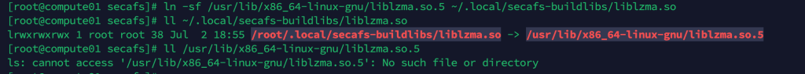
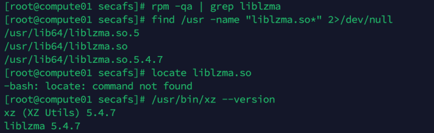
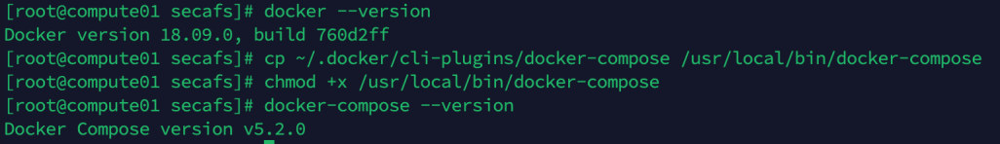
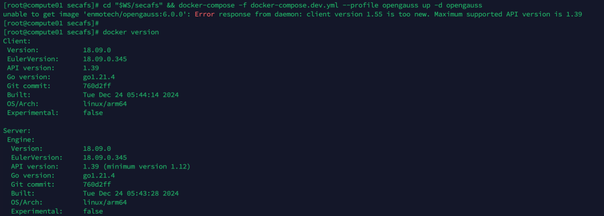
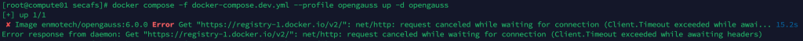
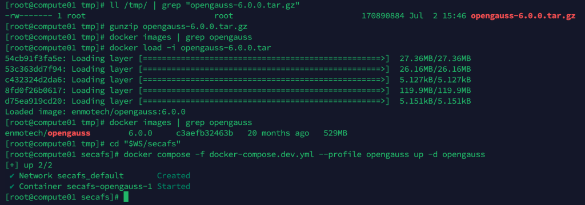
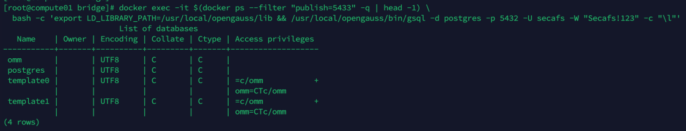
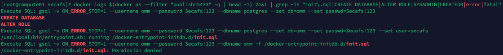

# 在openclaw中使用SecAFS

部署目标：跑起一个**由 SecAFS 支撑的 AI 聊天**：每次对话获得专属的、由 openGauss 支撑并通过 FUSE 挂载的工作区，Agent 在挂载点*内部*运行，所有读写被捕获、可事务、可回滚。OpenClaw 检出保持**上游原样（zero changes）**，SecAFS 以外部插件形式加载。

使用同级目录布局 `<workspace>/{openclaw, secafs}`，确定工作空间 `<workspace>`，在终端执行：
```bash
export WS=<workspace>
```
推荐的同级目录布局（脚本默认使用这些路径）：

```
<workspace>/
├── openclaw/     # 上游原样检出（第 1 步）
└── secafs/       # 本仓库
    └── integrations/openclaw/   # 你在这里
```


## 1. 下载openclaw源码

```bash
git -C "$WS" clone https://github.com/openclaw/openclaw.git
git -C "$WS/openclaw" checkout v2026.6.8-alpha.1
( cd "$WS/openclaw" && pnpm install && pnpm build )
```
<details>
<summary>错误排查：nodejs / npm / pnpm 版本不符合要求</summary>

openclaw运行环境需要pnpm, npm, nodejs, nvm，检查版本不符合要求时安装:

Node.js 是基础；npm 通常会随 Node.js 一起安装。npm 版本是动态的：Node.js 的每个主要版本都会捆绑一个特定版本的 npm。例如，Node.js v22.x 通常会自带 npm v10.x。因此，只要你成功安装了符合要求的 Node.js >=22.19.0，其自带的 npm 版本就大概率能满足项目需求。
```bash
# 查看openclaw依赖版本，nodejs>=22.19.0
grep -A 5 '"engines"' package.json
# 查看npm版本
node -v
npm -v

# 用 NVM 管理 Node.js 版本，安装完成后，重新加载配置文件让命令生效，再安装所需nodejs版本
curl -o- https://raw.githubusercontent.com/nvm-sh/nvm/v0.39.7/install.sh | bash
source ~/.bashrc
nvm install 22

# 安装pnpm
npm install -g pnpm
pnpm --version
```

</details>

## 2. secafs 守护进程
```bash
mkdir -p ~/.local/secafs-buildlibs
ln -sf /usr/lib/x86_64-linux-gnu/liblzma.so.5 ~/.local/secafs-buildlibs/liblzma.so
( cd "$WS/secafs/cli" && LIBRARY_PATH=~/.local/secafs-buildlibs cargo build -p secafs --no-default-features )
```
<details>
<summary>错误排查：liblzma 软链接 / cargo build 卡住</summary>

 * 创建软链接并不会检查源文件是否存在，所以创建软链接前，需要在环境中找到`liblzma.so.5`的路径，比如`/usr/lib64/liblzma.so.5`，然后软链接到 `~/.local/secafs-buildlibs/liblzma.so`。





 * cargo build -p secafs --no-default-features卡住，可能是网络原因。
打开另一个终端，运行 ping static.rust-lang.org 看网络是否通畅。
或者运行 ls -lh ~/.rustup/tmp 看临时文件大小是否在变化（在变说明在下载）。
若查看ls -lh ~/.rustup/tmp 文件大小没有变化，
换镜像：
```bash
# 1. 设置中科大镜像源
export RUSTUP_DIST_SERVER=https://mirrors.ustc.edu.cn/rust-static
export RUSTUP_UPDATE_ROOT=https://mirrors.ustc.edu.cn/rust-static/rustup

# 2. 清理可能损坏的临时缓存（重要）
rm -rf ~/.rustup/tmp/*

# 3. 重新执行编译命令
cargo build -p secafs --no-default-features
```

</details>

## 3. 插件
```bash
( cd "$WS/secafs/integrations/openclaw/plugin" && npm install && npm run build )
```
> **开发提示：** `npm install` 会覆盖 typecheck/tests 用的 `node_modules/openclaw` 符号链接。`npm run build` 不需要它；但运行 `npm test` / `npm run typecheck` 前需重新链接：
> ```bash
> ln -sfn ../../../../openclaw node_modules/openclaw
> ```
## 4. openclaw.json配置
配置 `~/.openclaw/openclaw.json`，只需要配置`apiKey`和`gateway.auth.token`。其他路径按需替换。
API_KEY需要自己申请，是sk-开头的字符串；token会在进行一次性的网关认证时自动生成，若没有自动生成，可以手动配置。
```bash
# 手动生成token并写入
openssl rand -hex 32
```

最小可用配置（替换 API Key；网关 token 与后续传给 bridge 的保持一致）：

```json5
{
  gateway: { mode: "local", auth: { mode: "token", token: "<GATEWAY_TOKEN>" } },
  env: { MINIMAX_API_KEY: "sk-..." },
  agents: {
    defaults: { model: { primary: "minimax/MiniMax-M3" } },
    list: [{ id: "main", default: true }],
  },
  models: { mode: "merge", providers: { minimax: {
    baseUrl: "https://api.minimaxi.com/anthropic",   // 国内 Key；海外用 api.minimax.io
    apiKey: "${MINIMAX_API_KEY}", api: "anthropic-messages",
    models: [{ id: "MiniMax-M3", name: "MiniMax M3", reasoning: true,
               input: ["text","image"], contextWindow: 1000000, maxTokens: 131072 }],
  } } },

  // 从本仓库加载外部插件（不复制进 openclaw 树）：
  plugins: {
    load: { paths: ["<workspace>/secafs/integrations/openclaw/plugin"] },
    entries: { "secafs-chat": { enabled: true, config: {
      manageDaemon: false,                             // run-stack.sh 自己跑守护进程
      socketPath: "/home/<you>/.secafs/run/secafs.sock",
      mountRoot: "/home/<you>/.secafs/mounts",
    } } },
  },
}
```
说明：
- `manageDaemon: false`，因为 `run-stack.sh` 在与网关**同一个 userns** 内自己启动守护进程，这样 FUSE 挂载对智能体的工具可见。(`manageDaemon: true` 会让网关自己 spawn 守护进程，那时需要在插件配置里加 `postgresUrl` —— 本套配置不用。)
- 运行时路径刻意放在 `~/.secafs/` 下 —— **不是 `/tmp`**，后者是 tmpfs 且会被 `systemd-tmpfiles` 老化清理，长会话期间会丢 socket / 挂载点。
- 插件配置项（除注明外均可选）：

  | key | 默认值 | 含义 |
  |---|---|---|
  | `socketPath` | `$XDG_RUNTIME_DIR/secafs/secafs.sock` | 守护进程 Unix socket |
  | `mountRoot` | `$XDG_STATE_HOME/secafs/mounts` | 每会话挂载的父目录 |
  | `manageDaemon` | `false` | 网关 spawn 守护进程（需 `postgresUrl`） |
  | `idleScanSeconds` | `2` | mount-keeper / 空闲扫描 tick（也是自愈 tick） |
  | `idleUnmountSeconds` | `0`（关闭） | 空闲自动卸载；默认关（见 RUNBOOK） |
  | `enableRollbackUI` | `true` | 注册 `secafs.rollback.*` + 逐回合快照 |


 * 一次性的网关认证引导
 配对前需要保证openGauss数据库已经启动，并且数据库中已经存在 `secafs` 数据库；daemon和gateway也需要通过run-stack.sh同时启动起来。可以先执行后面步骤，有待环境满足时进行此处的网关认证。

配对本设备并设置网关 token：

```bash
cd <workspace>/openclaw
pnpm openclaw onboard --non-interactive --accept-risk --mode local \
  --flow quickstart --auth-choice skip --gateway-auth token --gateway-bind loopback
```
onboard本身不生成paired.json，需要在浏览器打开IP页面 `http://127.0.0.1:8090` 点connect触发一次生成。

token会在进行一次性的网关认证时自动生成，若没有自动生成，可以手动配置。
```bash
# 手动生成token并写入
openssl rand -hex 32
```
查看token
```bash
cd <workspace>/openclaw
GATEWAY_TOKEN=$(node -e "console.log(require(require('os').homedir()+'/.openclaw/openclaw.json').gateway.auth.token)")
pnpm openclaw status --token "$GATEWAY_TOKEN"
```


配对的设备初始只有 `operator.pairing`；`secafs.*` 方法需要 `operator.admin`。权限升级审批在手动引导的网关上可能死锁，所以直接 seed 设备权限：

```bash
node -e '
const fs=require("fs"),os=require("os");const f=os.homedir()+"/.openclaw/devices/paired.json";
const d=JSON.parse(fs.readFileSync(f,"utf8"));
const want=["operator.pairing","operator.read","operator.write","operator.admin","operator.approvals"];
for(const id in d){const e=d[id];e.scopes=[...want];e.approvedScopes=[...want];if(e.tokens?.operator)e.tokens.operator.scopes=[...want];}
fs.writeFileSync(f,JSON.stringify(d,null,2));console.log("seeded device scopes");'
```
注意，此步执行前需要检查 `~/.openclaw/devices/paired.json` 文件是否存在，若不存在，需要先执行配对步骤。

```bash
ls -la ~/.openclaw/devices/paired.json
```

## 5.起 openGauss
```bash
( cd "$WS/secafs" && docker compose -f docker-compose.dev.yml --profile opengauss up -d opengauss )
```
<details>
<summary>错误排查：docker compose 安装 / Docker 版本 / 镜像拉取 / 数据库初始化（5 个常见问题）</summary>

**问题 1：安装 Docker Compose**

执行此步骤需要环境中有docker compose，附安装方式如下，若满足要求可直接执行下一步：

```bash
# 1. 创建插件目录（如果不存在）
mkdir -p ~/.docker/cli-plugins

# 2. 下载 Docker Compose V2（aarch64 架构）
curl -SL "https://github.com/docker/compose/releases/latest/download/docker-compose-linux-aarch64" -o ~/.docker/cli-plugins/docker-compose

# 3. 赋予执行权限
chmod +x ~/.docker/cli-plugins/docker-compose

# 4. 验证安装
docker compose version
```
如果直接下载有问题，可以尝试换镜像源，或者本地下载后通过scp上传到服务器。

**问题 2：Docker 引擎太旧，不支持 `compose` 子命令**

安装后仍出现 `docker: 'compose' is not a docker command.` 的提示，先检查文件本身：

```bash
file ~/.docker/cli-plugins/docker-compose
/root/.docker/cli-plugins/docker-compose: ELF 64-bit LSB executable, ARM aarch64, version 1 (SYSV
```
如果文件本身没问题（30MB、ARM aarch64 架构都对），那么检查Docker引擎版本，可能是因为 Docker 引擎版本太旧，不支持 docker compose 子命令。比如：

```bash

docker --version
Docker version 18.09.0, build 760d2ff
```
输出是 Docker version 19.03.x 或更早，就是不支持。

**问题 2 续：快速解决方案**

使用独立的 docker-compose 命令（最快）：有二进制文件，可以把它放到 /usr/local/bin/ 作为独立命令使用（不依赖 Docker 插件机制）：

```bash
# 1. 复制到系统路径
cp ~/.docker/cli-plugins/docker-compose /usr/local/bin/docker-compose

# 2. 赋予执行权限
chmod +x /usr/local/bin/docker-compose

# 3. 验证
docker-compose --version
```
**问题 3：Docker 客户端/服务端版本不兼容，需升级 Docker**



 * Docker 客户端版本太新，而 Docker 服务端版本太旧，两者 API 版本不兼容。需要升级docker版本。



```bash
# 1. 备份当前 Docker
systemctl stop docker

# 2. 下载官方 Docker 24.0.7（aarch64）
curl -SL "https://download.docker.com/linux/static/stable/aarch64/docker-24.0.7.tgz" -o /tmp/docker-24.0.7.tgz

# 3. 解压到临时目录
tar -xzf /tmp/docker-24.0.7.tgz -C /tmp/

# 4. 覆盖安装（备份旧文件）
mv /usr/bin/dockerd /usr/bin/dockerd.bak 2>/dev/null
mv /usr/bin/docker /usr/bin/docker.bak 2>/dev/null
cp /tmp/docker/* /usr/bin/

# 5. 重启 Docker
systemctl start docker

# 6. 验证
docker --version
# 应该显示 Docker version 24.0.7

用 docker compose（之前下载的 V2 插件）就能正常使用了
或者用 docker-compose（复制到 /usr/local/bin 的版本）也能用
```

**问题 4：拉取镜像超时，本地下载后上传**

拉取镜像超时，本地下载opengauss再上传

 

```bash
在另一台能访问 Docker Hub 的机器上：
# 1. 拉取镜像
docker pull enmotech/opengauss:6.0.0

# 2. 导出为 tar
docker save enmotech/opengauss:6.0.0 -o opengauss-6.0.0.tar

# 3. 压缩（可选，减小传输体积）
gzip opengauss-6.0.0.tar

# 4. 上传文件（在本地执行）
scp opengauss-6.0.0.tar.gz root@你的服务器IP:/tmp/

在服务器上：
# 5. 解压并导入
cd /tmp
gunzip opengauss-6.0.0.tar.gz
docker load -i opengauss-6.0.0.tar

# 6. 验证镜像已存在
docker images | grep opengauss

# 7. 再次启动
docker compose -f docker-compose.dev.yml --profile opengauss up -d opengauss
```
**问题 5：openGauss 容器里没有 secafs 数据库（权限问题）**



 * openGauss 容器里没有 secafs 这个数据库
```bash
# 确认数据库是否存在：
docker exec -it $(docker ps --filter "publish=5433" -q | head -1) \
  bash -c 'export LD_LIBRARY_PATH=/usr/local/opengauss/lib && /usr/local/opengauss/bin/gsql -d postgres -p 5432 -U secafs -W "Secafs!123" -c "\l"'
```



检查日志
```bash
docker logs $(docker ps --filter "publish=5433" -q | head -1) 2>&1 | grep -iE "init\.sql|CREATE DATABASE|ALTER ROLE|SYSADMIN|CREATEDB|error|fatal"
```
权限不足导致的问题：



对init.sql提权
```bash
ls -la $WS/secafs/scripts/opengauss-init.sql
chmod 644 /$WS/secafs/scripts/opengauss-init.sql
```
删卷重建

```bash
如果你不介意丢数据（dev 环境），把卷删掉让容器重新初始化：
cd $WS/secafs

# 停容器
docker compose -f docker-compose.dev.yml down opengauss

# 删卷（数据丢失，dev 环境无所谓）
sudo rm -rf .dev-ogdata

# 重新起，会跑 init.sql
docker compose -f docker-compose.dev.yml --profile opengauss up -d opengauss

# 等 10-20s 让它初始化完
sleep 15
docker logs --tail 30 $(docker ps --filter "publish=5433" -q | head -1)
```
验证 init.sql 成功执行，不再有 Permission denied 。
验证 secafs 库已创建。

</details>

## 6. 起整个栈（守护进程 + 网关 + Console bridge）—— 保持运行

```bash
( cd "$WS/secafs/integrations/openclaw/bridge" && nohup bash run-stack.sh > /tmp/secafs-stack.log 2>&1 & )
```

`run-stack.sh` 从自身位置推导所有路径，无需设置环境变量。可选覆盖（括号内为默认值）：`SECAFS_BIN_DIR`、`OPENCLAW_DIR`、`PG_URL`、`SOCK`（`~/.secafs/run/secafs.sock`）、`MOUNT_ROOT`（`~/.secafs/mounts`）、`BRIDGE_PORT`（`8090`）。

它**supervise 守护进程**（崩溃自动重启；先清理残留 FUSE 挂载点），并在 `BRIDGE_PORT` 未被占用时**自动启动 Console bridge**（从 `~/.openclaw/openclaw.json` 读取 `gateway.auth.token`）。

验证启动成功 `tail -f /tmp/secafs-stack.log`

等待 /tmp/secafs-stack.log 里出现 "[secafs-chat] plugin registered" 和 "gateway ready"

## 7. 打开 console

第 6 步已启动 bridge，直接访问 **http://127.0.0.1:8090**。

若仅需重启 bridge（例如轮换 gateway token 后），无需重启 daemon + gateway：

```bash
cd "$WS/secafs/integrations/openclaw/bridge"
pkill -f "node bridge.mjs"
OPENCLAW_DIR="$WS/openclaw" \
GATEWAY_TOKEN=$(node -e "console.log(require(require('os').homedir()+'/.openclaw/openclaw.json').gateway.auth.token)") \
PORT=8090 nohup node bridge.mjs > /tmp/secafs-bridge.log 2>&1 &
```

`FRONTEND_DIR` 无需设置 — `bridge.mjs` 从自身位置推导前端目录，找不到则拒绝启动。

可以使用本地shell ssh连接服务器，再打开浏览器访问IP页面。

```bash
# 将远程服务器的 8090 端口映射到本地。
# 这个终端保持开着，不要关，没有输出是正常的，SSH 在静默转发
ssh -L 8090:127.0.0.1:8090 -N root@<服务器IP>
```
然后在 本地浏览器 打开 **http://127.0.0.1:8090**。URL 预填 `ws://127.0.0.1:8090`，token 留空 → **Connect** → 状态应为 `connected · read+write`。

此时可以正常使用SecAFS的各种功能。

## 8. 使用 console

- **＋ New**（可带别名）创建每会话 FUSE 卷；文件树出现。新会话默认自动开启回滚快照。
- **Sessions 列表**（左）：🟢 已挂载 / ⚪ 已存库。点行打开（按需挂载）。逐行操作：✏️ 改名 · ⬇ 导出 · ⏏ 关闭（卸载，保留数据）· 🗑 销毁（永久删除文件 + 聊天 + 转录）。
- **Chat**（中）：智能体的 cwd **在 FUSE 挂载点内部**（Path C），所以它创建的文件出现在树里并持久化到 openGauss。
- **逐消息回滚**：hover 任意智能体回复 → **⏪** 把工作区文件*和*聊天历史回滚到该回复之后。**🕘** 打开更早时间点的恢复点时间线。
- **Files / Editor**（右）：点文件打开、编辑、**Save to SecAFS**。
- **Export / Import**：⬇ 把会话下载为 `.tar.gz`（manifest + workspace + chat）；**⬆ Import** 把一个会话作为*全新副本*（新 id）恢复 —— 跨机器 / 跨 openGauss 实例也可用。

---


## 9. 停止全部

```bash
# bridge + 网关按端口，守护进程按名（不要 `pkill -f "gateway run"`，
# 它会自匹配杀死命令所在行）：
for port in 8090 18789; do
  P=$(ss -ltnp 2>/dev/null | grep ":$port" | grep -oP 'pid=\K[0-9]+' | head -1)
  [ -n "$P" ] && kill "$P"
done
pkill -x secafs 2>/dev/null
cd <workspace>/secafs && docker compose -f docker-compose.dev.yml stop opengauss
```

> **注：** `run-stack.sh` 正常退出时会自动 kill bridge 和 daemon。上面按端口杀是兜底（比如 nohup 后直接 kill 了 run-stack.sh 的子 shell）。

数据安全：openGauss 在 `.dev-ogdata`，会话在 `~/.openclaw/agents/main/sessions/`。

## 10. 重启

以下需要启动并检查状态，确认是否就绪：
- openGauss 容器是否在跑
- daemon + gateway + bridge 是否起来了


### 启动 openGauss

```bash
cd $WS/secafs
docker compose -f docker-compose.dev.yml --profile opengauss up -d opengauss

# 等它就绪（看到 healthy 即可，约 10-20s）
sleep 15
docker ps --filter "publish=5433" --format "table {{.Names}}\t{{.Status}}"
```
预期看到 Up ... (healthy) 。

### 启动 daemon + gateway + bridge

```bash
cd $WS/secafs/integrations/openclaw/bridge
nohup bash run-stack.sh > /tmp/secafs-stack.log 2>&1 &
```

`run-stack.sh` 从自身位置推导路径，通常无需额外环境变量。等启动完成（约 10-20s）：

```bash
tail -f /tmp/secafs-stack.log
```

看到 `[run-stack] daemon socket up`、`[run-stack] starting Console bridge on :8090…`（如 bridge 未被占用）、`[gateway] ready` 就说明全部起来了，按 Ctrl+C 退出 tail（不会杀后台进程）。

